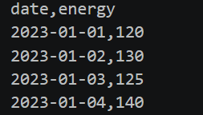
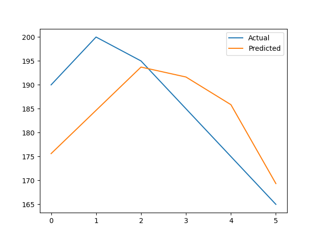
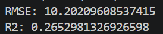

⚡ AI-Powered Energy Consumption Forecasting System  
🚀 End-to-End Machine Learning Project for Energy Forecasting

📌 Project Overview
This project predicts future energy consumption using Machine Learning based on historical time-series data.
It simulates how industries forecast energy demand to optimize usage and reduce operational costs.

🎯 Problem Statement
Traditional methods fail to accurately predict energy usage.
This project uses Machine Learning to:
Analyze historical energy data
Identify patterns
Forecast future energy demand

🚀 Features
Data preprocessing
Feature engineering
Linear Regression model
Energy consumption prediction
Visualization (Actual vs Predicted)
Model evaluation (RMSE, R²)

🛠 Tech Stack
Python
Pandas
NumPy
Scikit-learn
Matplotlib

## 📊 Dataset

### 🔹 Dataset Preview    

## 📊 Results

### 📈 Prediction Graph

### 📉 Model Output

## 📂 Project Structure

AI-Energy-Forecasting/
│
├── data/        → dataset  
├── src/         → source code  
├── images/      → screenshots  
├── outputs/     → results  
├── models/      → saved model  
├── notebooks/   → experiments  
├── docs/        → documentation  
├── main.py      → main execution file  
├── README.md    → project documentation

⚙️ Workflow
Load dataset
Preprocess data
Train model
Predict energy consumption
Evaluate performance
Visualize results

## ▶️ How to Run

Step 1: Install dependencies  
pip install -r requirements.txt  

Step 2: Run the project  
python main.py

🧠 Learning Outcomes
Time-series forecasting
Machine Learning model development
Data preprocessing
Visualization techniques

💡 Future Improvements
Use advanced models (Random Forest, LSTM)
Add external data
Build dashboard

📌 Author
Nidhi Apotikar
